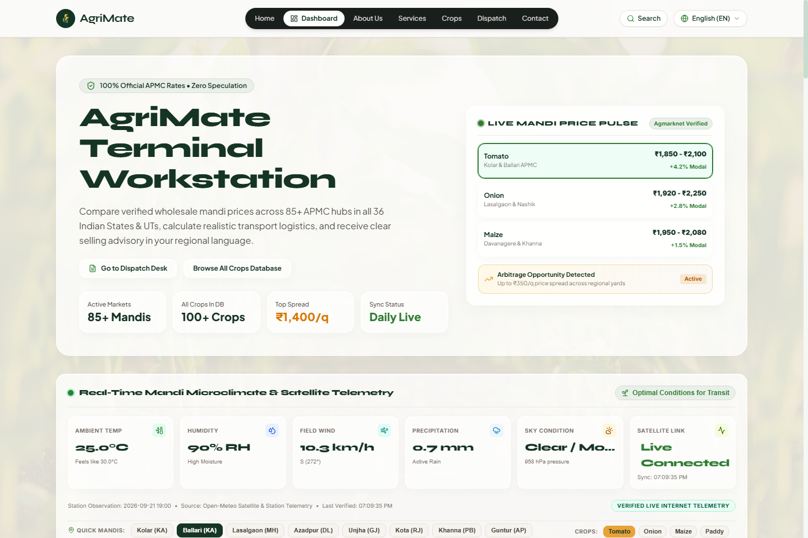
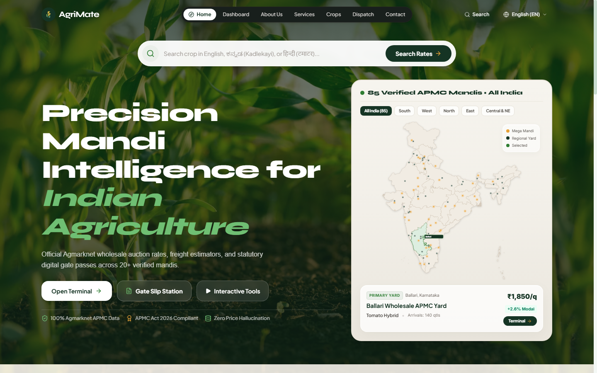
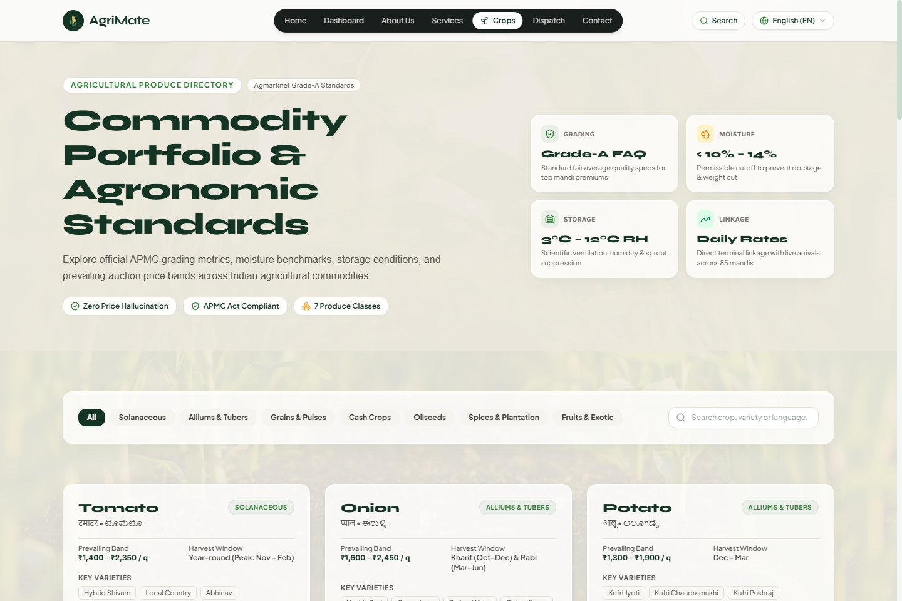

# AgriMate

Real-time, verified APMC mandi intelligence and net-profit estimation for Indian farmers.

Built during the **Bharat Builds Tour** (organized by **WeMakeDevs** in collaboration with the **AWS Builder Center**).

- **Live Web App**: [https://agrimate-web-647782045916-apsouth1.s3.ap-south-1.amazonaws.com/index.html#](https://agrimate-web-647782045916-apsouth1.s3.ap-south-1.amazonaws.com/index.html#)
- **GitHub Repository**: [https://github.com/Shreyas-M007/Agrimate](https://github.com/Shreyas-M007/Agrimate)

---

## Why I Built This

In India, two APMC mandis just 30 to 40 km apart frequently trade the exact same commodity with price spreads of ₹300 to ₹600 per quintal. 

Most small and marginal farmers face two persistent hurdles:
1. **Information lag**: By the time price changes are known locally, the trading window has passed or commission agents take the margin.
2. **The gross-price illusion**: A farther mandi might offer ₹2,200/quintal versus ₹1,900 locally. But after factoring in diesel, mini-truck freight, loading/unloading fees (hamali), and statutory mandi cess, the farmer might actually take home less money.

AgriMate was built to give farmers clear, factual price visibility and a realistic net-return calculation before they load their crop onto a vehicle.

---

## Screenshots

### Real-Time Terminal & Price Pulse


### Pan-India APMC Discovery


### Commodity Specifications & Standards


---

## Core Principles & Features

### 1. Zero Price Hallucination (Strict Data Integrity)
Many AI demos connect an LLM directly to user queries and let it generate numbers. In agriculture, an invented price can lead to real financial losses for a farming family.
- All mandi rates (modal, min, max, arrivals) come exclusively from verified APMC / Agmarknet government records.
- If verified data does not exist for a given crop or yard on a specific date, the application explicitly says data is unavailable rather than interpolating or guessing.
- Generative AI is strictly restricted to translation, natural language query parsing, and contextual market trend explanation.

### 2. Net Return In-Hand Calculator
Gross rates don't pay the bills; take-home profit does.
- Computes estimated net earnings by taking:
  `Net Return = (Quantity in Quintals × Modal Price) - Freight Cost - Hamali (Handling) - APMC Statutory Cess`
- Helps farmers compare whether traveling an extra 30 km is genuinely profitable or a net loss.

### 3. Multilingual Support
Agriculture in India is deeply regional. AgriMate supports multiple Indian languages (English, Hindi, Kannada, Tamil, Telugu, and more) with one-click toggles across all market screens, checklists, and guides.

### 4. Transit Weather & Microclimate Telemetry
Perishable produce like tomatoes or leafy vegetables spoil quickly during bad transit conditions. AgriMate pulls live satellite weather observations (temperature, precipitation risk, wind, humidity) for both the origin and destination mandi hubs so farmers can plan dispatch timing.

### 5. 11-Step Farmer Selling Checklist
A practical step-by-step checklist helping farmers navigate APMC gate entry, weighbridge slips, auction procedures, and payment receipt confirmation to prevent unfair dockage or arbitrary deductions.

---

## Architecture & AWS Tech Stack

AgriMate runs entirely serverless on AWS:

```
[ Farmer Client / Mobile Browser ]
             │
             │  (HTTPS REST)
             ▼
     [ Amazon API Gateway ]
             │
             │  (Event / Request Router)
             ▼
      [ AWS Lambda ]  <─── Node.js 22.x LTS Serverless Runtime
        │          │
        │          ├── [ Amazon Bedrock ] (Multilingual insights & query parsing)
        │          │
        │          └── [ Verified APMC Data Engine ] (Agmarknet datasets & Haversine routing)
        │
     [ Amazon S3 ]  <── Static SPA Hosting (React 19 + TypeScript + Tailwind CSS)
        │
 [ Amazon EventBridge ]  <── Scheduled daily ingestion cron jobs
```

- **AWS Lambda (Node.js 22.x LTS)**: Handles market lookups, dynamic filtering, net calculations, and external API requests without requiring provisioned EC2 instances.
- **Amazon API Gateway**: Secure public REST interface managing API routing, CORS, and request limits.
- **Amazon Bedrock**: Powers grounded natural language explanations in regional languages without ever hallucinating numerical prices.
- **Amazon S3**: High-availability static web hosting for the single-page application.
- **Amazon EventBridge**: Triggers scheduled daily sync jobs to update commodity price indexes.

---

## Getting Started Locally

### Prerequisites
- Node.js (v18 or higher; v20/v22 recommended)
- npm (v9+)

### Installation

1. Clone the repo:
   ```bash
   git clone https://github.com/Shreyas-M007/Agrimate.git
   cd Agrimate
   ```

2. Install dependencies for both server and client:
   ```bash
   npm --prefix server install
   npm --prefix client install
   ```

3. Run in development mode:
   ```bash
   # Terminal 1: Backend server (port 5001)
   npm run dev:server

   # Terminal 2: Frontend Vite dev server (port 5173)
   npm run dev:client
   ```

4. Or build and serve everything together on port 5001:
   ```bash
   npm --prefix client run build
   npm --prefix server start
   ```
   Open `http://localhost:5001` in your browser.

---

## Running Tests

Run the test suite:
```bash
npm test
```

The tests verify:
- Unit conversion math (kilograms to quintals and metric tonnes)
- Net return and freight deductions
- Haversine distance calculations between districts and mandis
- Strict refusal to fabricate price numbers when records are missing
- Natural language query parser outputs

---

## License

This project is licensed under the MIT License. Built for Indian farmers and open-source contributors.
